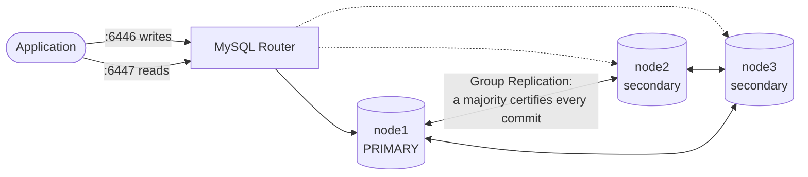

# PayFlow: a production-style MySQL platform for a remittance company


PayFlow is a fictional money-transfer company that sends money from the UK, the Gulf, North America and Europe to Pakistan, India, Bangladesh and the Philippines. This repository is its **database layer, designed and operated the way a production DBA team would run it**: a schema that refuses bad money data, high availability with measured failover, and, in the coming phases, backup and recovery, tuning, monitoring, security and compliance evidence, migration and cloud.

Everything is reproducible on a laptop with `make`, and every number below was measured, with raw logs in [docs/evidence/](docs/evidence/).

## Key results

| Area | Result |
|---|---|
| **Data integrity** | 10,000,201 transactions and 22.7M double-entry ledger lines; all 6 reconciliation checks clean (every currency nets to zero, every wallet matches its ledger) |
| **Concurrency** | 16 threads hammering 8 wallets: **0 deadlocks** with ordered row locking, versus 318 with a naive version under the same load; no money created or lost |
| **Automatic failover** | Primary killed (`SIGKILL`) under live writes: InnoDB Cluster elected a new primary on its own, with a **21–22 s** write outage at default settings (**6.5 s** tuned) |
| **Zero data loss** | **RPO = 0**: 158 of 158 and 152 of 152 acknowledged writes present after failover |
| **Replication** | Replicas seeded by Clone in 6 s, **0 s lag** at ~690 writes/s, table checksums identical to the primary |
| **Performance** | Under a mixed load: "recent activity" screen **15.7 s → 6.7 ms**, fee report **>120 s → 5.6 s**, customer screens 0.5 → 449 per second, payments not slowed |
| **Backup and recovery** | 7.4 GB hot backup in 29 s; nightly restore test; `DROP TABLE` recovered to the exact moment before: **RTO 33 s, RPO 0**, with payments running throughout |
| **Tests** | 46 SQL assertions on procedures and triggers, passing natively and in Docker |
| **Reproducibility** | From empty volumes: replication lab in 38 s, 3-node cluster in 48 s, 10M-row load in 6–8 min |

## Architecture



Each node holds the same schema: customers, KYC documents, wallets, beneficiaries, FX rates and fees; transactions with a double-entry ledger; and an append-only audit log. Money moves only through stored procedures.

## Roadmap

| # | Phase | What it shows | Status |
|---|---|---|---|
| 1 | [Schema design](docs/01-schema-design.md) | 3NF schema, double-entry ledger, deadlock-free stored procedures, audit triggers, 10M-row realistic dataset | ✅ Done |
| 2 | [Replication and HA](docs/02-replication-ha.md) | GTID replication with scripted manual failover; InnoDB Cluster + Router with measured automatic failover | ✅ Done |
| 3 | [Backup and disaster recovery](docs/03-backup-dr.md) | Nightly XtraBackup + MySQL Shell dumps on cron, continuous binlog archiving, automatic restore verification, PITR drill | ✅ Done |
| 4 | [Performance tuning](docs/04-performance-tuning.md) | Load test, slow log + pt-query-digest, EXPLAIN ANALYZE; query rewrite, online indexes, buffer pool sized from a capacity plan | ✅ Done |
| 5 | [Monitoring](docs/05-monitoring.md) | Prometheus, mysqld_exporter, Grafana; replication, failed-backup and database-down alert drills | ✅ Done |
| 6 | Security and compliance | Least-privilege roles, TLS, audit log, encryption at rest, monthly access-review report | Planned |
| 7 | Migration | Legacy PostgreSQL → MySQL, validated by row counts and checksums | Planned |
| 8 | Cloud | Terraform: Amazon RDS for MySQL with read replica, backups, CloudWatch alarms | Planned |

## What's inside

### Phase 1: a schema that protects money

- **Double-entry ledger.** Every movement posts equal debits and credits, so `SUM(balance)` per currency is always zero. One query proves the books balance.
- **Stored procedures** for deposit, transfer, cross-border send and refund. Each runs as a single transaction and rolls back fully on any error. Each is **idempotent**: a retried request never charges twice. Each **locks wallets in a fixed order**, so opposite transfers can't deadlock.
- **Constraints that do real work.** CHECK constraints stop customer wallets going negative, require every failed transaction to state a reason, and give each transaction type exactly the fields it needs.
- **Audit and immutability.** Triggers record before/after JSON for every sensitive change, mask national IDs, and block edits or deletes on transactions and ledger lines. Corrections are posted as reversals, as in real accounting.
- **A dataset that behaves like a real business.** Two years and 10M transactions, with salary-week and pre-Eid peaks, a growing customer base, failed payouts and refunds, all simulated in time order so every balance reconciles.

### Phase 2: staying up when a server dies

- **Classic replication:** Clone-seeded replicas, GTID auto-positioning, TLS, `super_read_only`, and a [promotion script](docker/replication/promote.sh) that refuses unsafe failovers (replicas that are behind, errant GTIDs).
- **InnoDB Cluster:** built with MySQL Shell's AdminAPI and fronted by MySQL Router, plus a [failover demo](docker/cluster/failover-demo.sh) that kills the primary under write load and reports the outage, the RPO and the rejoin time.
### Phase 3: getting data back

- **Three layers of backup:** a nightly XtraBackup (hot, prepared), a nightly MySQL Shell dump (parallel, zstd), and **continuous binlog streaming** (0.7 s behind the server), scheduled by cron in an [ops container](docker/ops/Dockerfile).
- **Verified every night:** the latest backup is restored to a private server and checked for row counts and ledger balance.
- **[PITR drill](docs/03-backup-dr.md#the-drill-drop-table-kyc_documents-at-135555):** a table is dropped mid-traffic, then restored on a side server up to the exact GTID before the `DROP` and copied back. RTO was 33 s, RPO 0, and not one payment failed.
- **Evidence trail:** every run is recorded in `ops.backup_history` for auditors.

### Phase 4: making it fast, with evidence

- **Measure first:** a [load generator](scripts/loadgen.py) runs payments, customer screens and reports together, with the slow log on. `pt-query-digest` showed two queries taking **80 %** of server time.
- **Fix the cause:** the worst query needed no index. An `OR` across two columns forced a 10M-row scan, and a `UNION ALL` rewrite took it from 19.6 s to 5 ms. Five online indexes (`LOCK=NONE`, under 50 s each) fixed the rest.
- **Size memory from data:** a [capacity plan](docs/evidence/phase4/capacity.md) found a 1.3 GB hot working set, so the buffer pool went from 1 GB to 2 GB, resized online in 1 s.
- **Check the cost:** payment throughput and latency were measured in every run. They ended slightly better than before, and the worst case improved 3.5×.

- **A tuning decision backed by data:** the [design doc](docs/02-replication-ha.md#failover-results) traces the outage second by second, shows that `expelTimeout=0` cuts it from 21 s to 6.5 s, and explains why a payments system should still keep the safer default.

### Phase 5: monitoring and operational response


*Live monitoring after the alert drills. One standalone server is running; the replication lab is stopped to fit the VM memory budget. Red shaded regions mark alert intervals.*

- **Live metrics and dashboards:** Prometheus probes the standalone server and classic replicas, Grafana shows database and host metrics, and backup jobs report outcomes through Pushgateway.
- **Measured alerts:** the final production drill detected a failed backup in **29 s** and a stopped database in **39 s**, with firing and resolved webhook delivery verified. Replication lag and stopped-thread drills are also recorded.
- **Operational safeguards:** memory budgets for the small VM, backup disk-headroom checks, cleanup handlers for interrupted drills, and [alert runbooks](docs/runbooks.md). All six recovery reconciliation checks passed after the final drill.

## Skills demonstrated

| DBA skill | Where |
|---|---|
| Database design, normalisation, constraints | [schema/01_tables.sql](schema/01_tables.sql) |
| Transactions, isolation, row locking, deadlock avoidance | [schema/02_procedures.sql](schema/02_procedures.sql), [scripts/concurrency_test.py](scripts/concurrency_test.py) |
| Triggers, auditing, data immutability | [schema/03_triggers.sql](schema/03_triggers.sql) |
| Bulk loading and large datasets | [scripts/generate_data.py](scripts/generate_data.py), [scripts/load_data.sh](scripts/load_data.sh) |
| GTID replication, Clone plugin, manual failover | [docker/replication/](docker/replication/) |
| Backup, restore, PITR, binlog archiving, DR drills | [backup/](backup/), [docs/03-backup-dr.md](docs/03-backup-dr.md) |
| InnoDB Cluster, Group Replication, MySQL Router, MySQL Shell | [docker/cluster/](docker/cluster/) |
| Query optimisation, indexing, EXPLAIN ANALYZE, slow log, pt-query-digest, capacity planning | [tuning/](tuning/), [docs/04-performance-tuning.md](docs/04-performance-tuning.md) |
| Monitoring, dashboards, alert routing, incident response | [monitoring/](monitoring/), [docs/05-monitoring.md](docs/05-monitoring.md), [docs/runbooks.md](docs/runbooks.md) |
| Testing, reconciliation, evidence-based reporting | [schema/tests/](schema/tests/), [schema/queries/](schema/queries/), [docs/](docs/) |
| Linux, Bash, Docker, automation with `make` | [Makefile](Makefile), [scripts/lib/common.sh](scripts/lib/common.sh) |

## Run it yourself

**You need:** Docker with 4 GB+ memory (Docker Desktop, or [Colima](https://github.com/abiosoft/colima) on a Mac without admin rights), Python 3.9+, and about 15 GB of free disk for the full dataset.

**Quick look (about 2 minutes):** start MySQL and run the tests.

```bash
make up                 # MySQL 8.4 in Docker; creates .env with random passwords
make test               # 46 procedure and trigger tests
```

**Full dataset (about 15 minutes):** 10M transactions, then the integrity checks and the slow-query baseline.

```bash
make generate           # ~10M transactions -> data/generated/ (4–5 min)
make setup              # schema + bulk load + triggers
make reconcile          # every check should come back empty
make workload           # time the reporting queries Phase 4 will optimise
pip install -r requirements.txt && make concurrency
```

**High availability labs:** use the 200k-row dataset and run one lab at a time.

```bash
make down                                         # free the single server's memory
make repl-up repl-setup repl-status               # primary + 2 replicas
make repl-promote TARGET=replica1                 # manual failover
make repl-down

make cluster-up cluster-setup                     # InnoDB Cluster + Router
make failover-demo                                # kill the primary under load and measure
make cluster-down
```

**Backup and DR** run on the full-size server:

```bash
make up ops-setup ops-up            # backup account, cron ops container, binlog archiver
make backup-full backup-verify      # nightly jobs on demand
make pitr-drill                     # drop a table, recover it, measure RTO/RPO
```

**Performance tuning** (needs the venv: `python3 -m venv .venv && .venv/bin/pip install -r requirements.txt`):

```bash
make perf-run LABEL=before          # 3-minute mixed load + slow log + pt-query-digest
make tuning-apply                   # online indexes
make perf-run LABEL=after ARGS="--q2 rewrite"
make capacity                       # growth and 12/24-month sizing
```

`make help` lists every command.

## Repository layout

```
schema/                 tables, procedures, triggers, SQL tests, reconciliation and workload queries
docker/standalone/      Phase 1: single MySQL server
docker/replication/     Phase 2a: primary + 2 replicas (setup, status/checksums, promote)
docker/cluster/         Phase 2b: InnoDB Cluster, Router, failover demo
docker/ops/             ops image: XtraBackup, MySQL Shell, Percona Toolkit, mysqlbinlog, cron
backup/                 Phase 3: backup jobs, binlog archiver, verification, PITR drill
tuning/                 Phase 4: perf runs, EXPLAIN ANALYZE capture, indexes, capacity plan
monitoring/             Phase 5: metrics, dashboards, alert rules and lab drills
scripts/                data generator, bulk loader, concurrency test, shared helpers
docs/                   design notes and results per phase
docs/evidence/          raw logs behind the numbers above
```
