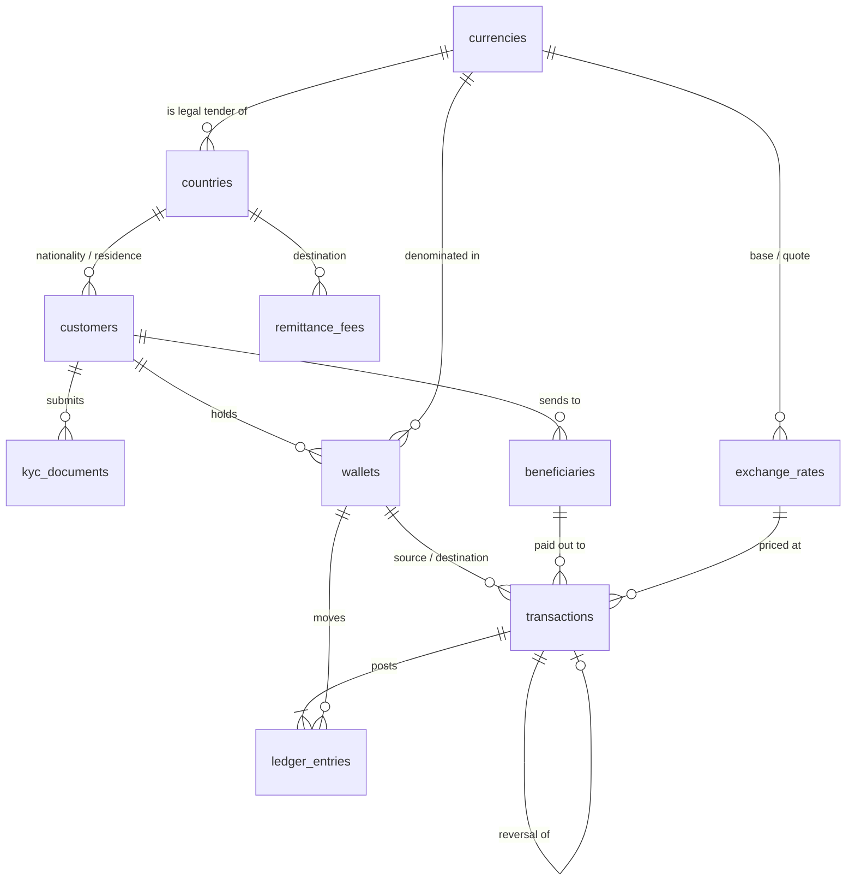

# Phase 1 — Schema design

PayFlow is a fictional remittance company: customers in the UK, Gulf, North America, Europe and Australia send money home to Pakistan, India, Bangladesh and the Philippines. This phase designs the database it runs on and fills it with ten million realistic transactions.

## Entity model

`audit_log` stands apart: triggers write to it and nothing references it.

| Table | Purpose | Rows (full dataset) |
|---|---|---|
| `currencies`, `countries` | Reference data | 11, 13 |
| `exchange_rates` | Daily customer FX rate per corridor (28 corridors × 730 days) | ~20k |
| `remittance_fees` | Fee bands by send currency × destination | 84 |
| `customers` | Senders, plus one `system` customer that owns the house wallets | ~200k |
| `kyc_documents` | Passports, national IDs, residence permits, proof of address | ~480k |
| `wallets` | One per customer per currency, plus settlement and fee-revenue wallets | ~220k |
| `beneficiaries` | Recipients abroad: bank account, mobile wallet or cash pickup | ~380k |
| `transactions` | One row per business event | ~10M |
| `ledger_entries` | Double-entry lines; the source of truth for balances | ~23M |
| `audit_log` | JSON before/after images written by triggers | grows from zero |

## Design decisions

**Double-entry ledger.** Balances are never edited directly. Every money movement posts equal debits and credits to `ledger_entries`, and `wallets.balance` is a cached running total kept in step inside the same transaction. The other side of each customer entry is a *house wallet* owned by PayFlow: a deposit debits the settlement wallet, and a remittance credits settlement (money owed to the payout partner) and fee revenue. As a result, for every currency `SUM(wallets.balance) = 0`, which gives a one-line integrity check (`make reconcile`). `balance_after` on each line means a statement never has to re-add history.

**Money is `DECIMAL(19,4)`.** Never `FLOAT`. The generator works in integer cents for the same reason.

**Third normal form, with two deliberate exceptions.** `transactions.currency_code` repeats the source wallet's currency. A deposit has no source wallet, and filtering by currency without a join is common in reporting. `payout_amount` stores the result of amount × rate so the amount the customer was quoted is preserved even if rate rows were ever corrected.

**Constraints do real work.** The database refuses bad data that an application bug might write:
- `chk_wallet_no_overdraft`: customer wallets can't go negative. House wallets can, because settlement is the contra side of deposits.
- `chk_txn_shape`: each transaction type has exactly the wallet, beneficiary and reversal columns it needs.
- `chk_beneficiary_bank` and `chk_beneficiary_mobile`: a bank payout must have an account number, and a mobile-wallet payout must have a mobile number.
- `chk_txn_failed_reason`: a failed transaction must say why.

The generator's output loads with every CHECK constraint enforced, so these constraints double as a test of the generator.

**Append-only money records.** Triggers block `DELETE` on `transactions`, `ledger_entries`, `wallets` and `audit_log`. On `transactions`, they allow only the lifecycle columns (`status`, `failure_reason`, `completed_at`) to change, and only while the row is `pending`. Mistakes are corrected by posting a `reversal`, the way an accounting system would. Note that `DROP TABLE` is not blocked by triggers. Recovering from that is the disaster-recovery phase.

**Audit trail.** Changes to customers, KYC documents, beneficiaries, wallet status and transaction status write JSON before/after images to `audit_log`. Each row records the MySQL account (`USER()`), the application's end user (`@app_user`, set by the app per session) and the connection id. National ID numbers are masked (`***34-1`) so the audit log doesn't become a second copy of the PII. Balance changes aren't audited by trigger because the ledger already records each one, more strictly.

**Idempotency.** Every public procedure takes a client-supplied `idempotency_key` (unique). Retrying a call after a timeout returns the original `txn_id` instead of moving money twice. If two calls with the same key race, the second one hits the unique key and gets a duplicate-key error. When it retries, the lookup returns the first call's transaction.

**Indexes: only what correctness needs.** Phase 1 creates primary keys, unique keys (business identifiers, idempotency keys) and the indexes InnoDB requires for foreign keys. Indexes for reporting queries are deliberately left out. [schema/queries/workload.sql](../schema/queries/workload.sql) lists the queries that need them, and the performance phase adds them based on slow-log and `EXPLAIN ANALYZE` evidence rather than guesswork.

## Transactions and locking

The stored procedures in [02_procedures.sql](../schema/02_procedures.sql) are the only intended way to move money:

| Procedure | What it does |
|---|---|
| `sp_deposit` | Credit customer wallet, debit settlement |
| `sp_transfer_funds` | Same-currency transfer between two customer wallets |
| `sp_send_remittance` | Validate KYC, beneficiary ownership, fee band and FX rate; debit amount + fee; status `pending` |
| `sp_complete_remittance` | Payout partner callback: mark `completed`, or `failed` + post a reversal that refunds amount and fee |
| `sp_wallet_statement` | Ledger lines for a wallet over a date range |

Each procedure follows the same pattern:

1. **Validate outside the transaction.** Checks that don't need locks run first: amount, idempotency, wallet existence, currency, KYC status, fee band and rate lookup. A rejected request never takes a row lock.
2. **`START TRANSACTION`, then lock every wallet it will touch in ascending `wallet_id` order** (`sp_lock_wallets`). This is what prevents deadlocks. If one session transfers A→B while another transfers B→A, both try to lock the lower id first, so one simply waits for the other. Without a global order, each would hold one lock and wait forever for the other, and InnoDB would kill one as a deadlock victim.
3. **Re-read balances with locking reads (`SELECT … FOR UPDATE`).** Under REPEATABLE READ a plain `SELECT` could return a snapshot older than the lock. A locking read always returns the latest committed row. `FOR UPDATE OF w` locks the wallet without also locking the joined customer row.
4. **Check the balance, insert the transaction, post ledger lines, `COMMIT`.** Any error triggers the `EXIT HANDLER`, which runs `ROLLBACK` and then `RESIGNAL`, so the caller sees the original error and nothing is half-written.

`scripts/concurrency_test.py` demonstrates this. Sixteen threads fire thousands of random transfers in both directions over eight wallets, then the script checks that the total is unchanged, no wallet went negative, and every balance matches its ledger. With `--naive`, it runs the same load through a procedure that locks in argument order, and deadlocks appear.

**Known hot spot, left for the tuning phase.** Every deposit and remittance in a currency updates that currency's single settlement wallet row, which serialises them. That doesn't matter at test volumes, but it's a classic production bottleneck. Fixes include sharding the house wallet into N sub-wallets, or posting house-side entries asynchronously. Load testing in the performance phase measures it before anything is changed.

## The dataset

`scripts/generate_data.py` (standard library only, deterministic for a given `--seed`) simulates two years of business, 2024-10-01 to 2026-09-30, in time order:

- **Customers:** 40% exist at the start and the rest sign up over the window, so volume roughly doubles over two years. Names, national ID formats, banks and mobile-wallet providers match each corridor. 88% are KYC-verified. Some ID documents have expired, which gives the compliance queries something to find.
- **Behaviour:** Activity per customer is heavy-tailed (Pareto, capped at about 11× the average), so a few customers send a lot without any single account dominating. Volume peaks in salary week (the 25th to the 5th), in the ten days before each Eid, and in the evening (UTC).
- **Mix:** about 47% remittances, 39% deposits, 7% transfers and 6% withdrawals. A customer who doesn't have enough balance to send tops up first, which is why deposits run high. About 2% of remittances fail and are refunded by a later reversal. Some remittances near the end of the window are still pending, and about 9,000 are stuck pending for more than a day, so the stuck-payment alert has something to catch.
- **Consistency:** The generator tracks every balance and checks before writing that no customer wallet went negative and every currency nets to zero. The database then checks the same invariants again after loading.

Output is CSV for `LOAD DATA INFILE`. The two big tables are split into 1M-row files so each load statement is a bounded transaction. The loader disables the InnoDB redo log, FK checks, unique checks and binary logging for the initial load only, and explains why in [scripts/load_data.sh](../scripts/load_data.sh).

## Server version

The schema targets **MySQL 8.4 LTS**. MySQL 8.0 reached end of life in April 2026, so a new production system would start on 8.4. Everything here also runs on 8.0.30+ (`innodb_redo_log_capacity` and `FOR UPDATE OF` were added during the 8.0 series).
