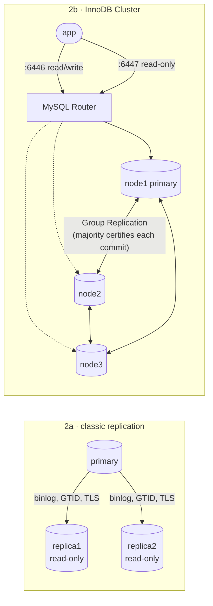

# Phase 2: Replication and high availability

A payments database can't be a single server. This phase builds two topologies on the same MySQL 8.4 servers and measures what each one does when the primary crashes:

1. **Classic asynchronous replication** with GTIDs: one primary and two read-only replicas. A DBA has to perform the failover.
2. **InnoDB Cluster**: three Group Replication nodes behind MySQL Router. Failover is automatic and no acknowledged write is lost.

Both labs run on a laptop in Docker. Each uses the 200k-transaction dataset (`make generate-small`), so three copies fit in a 4 GB VM. From empty volumes, `make` builds the replication lab in 38 s and the cluster in 48 s.



## 2a: Classic GTID replication

```bash
make down              # free the memory the Phase 1 server uses
make repl-up           # primary :3311, replica1 :3312, replica2 :3313
make repl-setup        # load primary, clone replicas, start replication
make repl-status       # threads, lag, and table checksums vs the primary
make repl-promote TARGET=replica1   # manual failover (see below)
```

### Choices

| Choice | Why |
|---|---|
| **GTID auto-positioning** (`SOURCE_AUTO_POSITION=1`) | Replicas track *which transactions* they've applied rather than a binlog file and offset. Any replica can be repointed at any other server without working out positions by hand, which is what makes promotion safe to script. |
| **Seed replicas with the Clone plugin** | `CLONE INSTANCE FROM primary` copies the data directory physically, including `gtid_executed`, so replication starts exactly where the copy ends. This took 6 s for 185 MB, versus a dump and restore that would also rebuild every index. The 10M-row Phase 1 load deliberately skipped the binlog for the same reason. |
| **`super_read_only`, set with `SET PERSIST`** | A replica that accepts writes silently diverges. `super_read_only` blocks even accounts with `SUPER`. It is set after setup, not in `my.cnf`, because the image's first-start initialisation needs to write. |
| **`REQUIRE SSL` on the replication account** | Replication traffic carries customer data. |
| **`log_replica_updates`** | Every replica writes its own binlog, so any of them can become a source after promotion. |
| **4 parallel applier threads, `replica_preserve_commit_order`** | Applies independent transactions in parallel (WRITESET tracking) while still committing them in the primary's order. Readers never see a state the primary didn't have. |
| **`relay_log_recovery`** | After a replica crash, discard possibly half-written relay logs and fetch them again from the source. |

### Results

| Test | Result |
|---|---|
| Clone each replica (185 MB) | **6 s** |
| Replica lag under load (9,600 transfers at ~690 writes/s on the primary, sampled every 1.5 s) | **0 s** throughout |
| `CHECKSUM TABLE` on 7 tables, replicas vs primary, after the load | **identical** |
| `UPDATE` on a replica | rejected: `ERROR 1290 … --super-read-only` |
| `docker kill` the primary, then `promote.sh replica1` | replica1 writable, replica2 repointed; no transaction lost (both at the same GTID set) |
| Old primary restarted, `--rejoin-old` | it rejoins as a replica of replica1, and checksums are identical on all three |
| Planned switchover on a fresh build (`make repl-promote TARGET=replica2`, primary still up) | replica2 promoted in 1 s, both others repointed to it, same GTID set everywhere |

### Manual failover: what `promote.sh` does

This is the runbook a DBA would follow at 3 a.m.:

1. **Choose the most up-to-date replica.** The script refuses if another running replica has applied transactions the target lacks.
2. **Drain the relay log.** Wait until the target has *applied* everything it already *received* (`WAIT_FOR_EXECUTED_GTID_SET`).
3. **Promote.** `STOP REPLICA; RESET REPLICA ALL;` then turn off `super_read_only`.
4. **Repoint the other replicas** with GTID auto-position.
5. **Refuse to attach a server with errant GTIDs.** An old primary that comes back with transactions nobody else has would silently diverge, so it has to be rebuilt by cloning.

The script runs in about 2 s. The real outage is everything around it: someone has to notice, decide, run it, and repoint the application. And because replication is **asynchronous**, any transaction the primary committed but hadn't yet sent is lost (**RPO > 0**). In this test the primary was idle when killed, so nothing was in flight. That gap is why the next section exists.

## 2b: InnoDB Cluster

```bash
make repl-down         # free memory
make cluster-up        # node1..3 (:3321-3323), tools (MySQL Shell), router (:6446/:6447)
make cluster-setup     # load node1, AdminAPI builds the cluster, Router bootstraps
make cluster-status
make failover-demo     # the recording
```

### How it's built

[setup-cluster.js](../docker/cluster/setup-cluster.js) uses MySQL Shell's AdminAPI in three steps:

1. `dba.configureInstance` on each node checks the Group Replication prerequisites (GTIDs, primary keys on all tables, no MyISAM) and creates the `clusteradmin` account.
2. `dba.createCluster('payflow')` on node1, which holds the data.
3. `cluster.addInstance(node2|node3, {recoveryMethod: 'clone'})`. Each node received 348 MB in about 1 s and was ONLINE about 20 s after the call, including the restart that clone requires.

AdminAPI reported **errant GTIDs (`…:1-5`) on node2 and node3**. These are the five transactions the Docker image's first-start script ran to create the root account. They're harmless here, and the clone discarded them. On real servers the same warning would mean someone wrote to a server outside the cluster, and it would have to be investigated before cloning over it.

[MySQL Router](../docker/cluster/router-entrypoint.sh) bootstraps from the cluster metadata and then follows topology changes on its own. The application connects to the router, never to a node:
- **6446** always reaches the current primary.
- **6447** load-balances across the secondaries.

### Why no acknowledged write is lost

In single-primary Group Replication, a commit is acknowledged to the client only after a **majority of members** has received and certified the transaction. If the primary dies, a majority already holds every transaction the application was told succeeded, and the new primary is elected from that majority. With three nodes, one can fail. A fourth node wouldn't add tolerance (4 nodes need a majority of 3), but five nodes would tolerate two failures.

### Failover results

[failover-demo.sh](../docker/cluster/failover-demo.sh) runs a write probe that opens a new connection through Router every 200 ms and deposits 1.00 with a unique idempotency key. After 10 s it `SIGKILL`s the primary's container. When the probe finishes, the script compares what the app was told with what's in the database, then restarts the dead node and times its rejoin. Raw logs are in [docs/evidence/](evidence/).

| | Default (`expelTimeout = 5`), run 1 | Default, run 2 (fresh rebuild) | Tuned (`expelTimeout = 0`) |
|---|---|---|---|
| Write outage (kill → first commit on the new primary) | **21.1 s** | **21.9 s** | **6.5 s** |
| Acknowledged writes / present after failover | 158 / 158 | 152 / 152 | 144 / 144 |
| Failed attempts that committed anyway | 0 | 0 | 0 |
| **RPO** | **0** | **0** | **0** |
| Killed node back ONLINE as secondary | 21 s | 19 s | 22 s |
| Who took over | node2 (automatic) | node2 (automatic) | node1 (automatic) |

Here's where the 21 s went in the default run, from node2's error log:

| Time | Event | Elapsed |
|---|---|---|
| 13:01:06.0 | node1 killed | 0 |
| 13:01:10.9 | `Member with address node1:3306 has become unreachable` | ~5 s (failure detector) |
| 13:01:26.5 | `Primary … left the group. Electing new Primary` → node2 | **+15.6 s** (waiting to be sure before expelling) |
| 13:01:27.2 | first write committed via Router on node2 | +0.6 s (Router) |

Router isn't the bottleneck. Almost all of the outage is Group Replication deciding that an unreachable member is really gone. Setting `group_replication_member_expel_timeout` (AdminAPI `expelTimeout`) to 0 expels it as soon as it is suspected, which cut the outage to 6.5 s.

**This lab keeps the default (5 s)** even though 0 is faster. With 0, a few seconds of network trouble, such as a GC pause or a congested switch, expels a healthy member. If that member is the primary, it causes an election and clients get errors for nothing. A payments platform should see a ~20 s outage only when a server really dies, rather than false failovers on every hiccup. Either way, the application must retry failed writes, and the idempotency key makes retries safe: the probe's failed attempts can all be retried without double-charging.

### Classic replication vs InnoDB Cluster

| | Classic async replication | InnoDB Cluster |
|---|---|---|
| Failover | Manual (`promote.sh`), minutes once a human is involved | Automatic, 6–21 s measured |
| Data loss on primary crash | Possible: in-flight transactions not yet sent | **None** for acknowledged commits |
| Commit latency | Unaffected by replicas | One network round trip to a majority on every commit |
| App connection | Must be repointed (DNS, VIP or config) | Router follows the primary |
| Old primary returning | Must be checked for errant GTIDs and rebuilt or attached | Rejoins automatically, catches up, becomes secondary |
| Good for | Read scaling, reporting replicas, cheap DR copies | The system of record |

For PayFlow, the ledger runs on the InnoDB Cluster, and an async replica of the cluster can serve reporting without adding load to the group.

## Not covered (yet)

- **Network partitions** (as opposed to crashes). A minority partition should refuse writes. That should be tested by isolating a node's network, not by killing it.
- **Router high availability.** One Router container is a single point of failure. In production a Router runs beside each application instance.
- **Disaster recovery across regions** (InnoDB ClusterSet), and backups, which are Phase 3.
- **Replication lag under heavier load**, and alerting on it, which are Phases 4 and 5.
