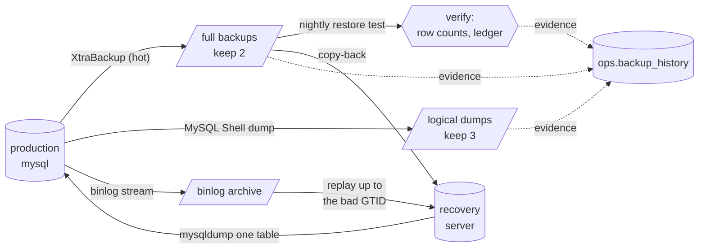

# Phase 3: Backup and disaster recovery

Backups only count if they can be restored, quickly, to the right moment. This phase runs three kinds of backup against the 10M-transaction production server, verifies them automatically, and rehearses the incident every DBA dreads: a table dropped during business hours.

| What | Tool | When | Result on 10M transactions |
|---|---|---|---|
| Full physical backup | Percona XtraBackup 8.4 (hot, prepared immediately) | nightly 01:00 UTC | **7.4 GB in 29 s**, no downtime |
| Logical backup | MySQL Shell `util.dumpSchemas` (4 threads, zstd, consistent) | nightly 02:30 UTC | **983 MB in 87 s** |
| Binary log archive | `mysqlbinlog --read-from-remote-server --raw --stop-never` | continuous | **< 1 s behind** the server |
| Restore verification | restore latest full backup, start a private `mysqld`, check data | nightly 04:00 UTC | **34 s**: 10,000,201 transactions present, ledger balanced |
| **PITR drill** | restore + binlog replay to just before a `DROP TABLE` | on demand | **RTO 33 s, RPO 0** |



## How it runs

```bash
make up ops-setup ops-up    # server, backup account + ops.backup_history, ops container + archiver
make backup-full            # the nightly jobs, on demand
make backup-logical
make backup-verify
make backup-status          # evidence trail and archived binlogs
make pitr-drill             # the drill below
```

Two containers sit beside the server. Both are built from [docker/ops/Dockerfile](../docker/ops/Dockerfile), which adds XtraBackup, MySQL Shell, Percona Toolkit and `mysqlbinlog` to the MySQL 8.4 image:

- **ops** runs `crond` with [the schedule](../backup/crontab) and has the server's data volume mounted read-only for XtraBackup.
- **binlog-archiver** runs [binlog-archiver.sh](../backup/binlog-archiver.sh). It connects like a replica, writes every binlog to the backup volume as it's produced, and reconnects on its own after restarts.

Every job writes a row to **`ops.backup_history`**: job, status, start and end time, size, location, and JSON details such as the binlog coordinates of each full backup. When the monitoring stack is up, each job also pushes success and failure metrics to Prometheus (Phase 5). That table is the evidence auditors ask for, and the compliance report in Phase 6 is generated from it.

### Choices

| Choice | Why |
|---|---|
| **XtraBackup for the nightly full** | A hot physical copy: no `mysqldump`-style hours-long rebuild of indexes on restore, and no global lock for InnoDB. Restore time is roughly copy time. |
| **Prepare at backup time** | `--prepare` (applying the redo log) is done straight after the backup, so a restore is a plain copy. That costs disk, but it's what keeps RTO low. |
| **A logical dump as well** | Portable across versions and platforms, and readable. It also allows single objects to be restored, and if a physical backup is ever found corrupt, the logical one is an independent second copy. |
| **Continuous binlog streaming, not periodic copying** | A cron job copying binlogs every 15 minutes means up to 15 minutes of loss if the server's disk dies. Streaming brings that down to the archiver's lag, which was 0.7 s measured. |
| **A dedicated `backup` account** | It holds only `BACKUP_ADMIN`, `RELOAD`, `PROCESS`, `LOCK TABLES`, `REPLICATION CLIENT/SLAVE` and read access, plus `INSERT` on the history table. It connects with `REQUIRE SSL`, and its credentials are in an option file, never on a command line where `ps` would show them ([backup/setup.sql](../backup/setup.sql)). |
| **Verify every night** | The script starts a separate `mysqld` on a restored copy and checks row counts and the double-entry invariant. Every client call there names the local socket explicitly. See *Lessons* for why. |
| **Retention** | 2 full backups and 3 logical dumps (`KEEP_FULL`, `KEEP_LOGICAL`). Binlogs are kept 7 days on the server and archived beyond that. |

## The drill: `DROP TABLE kyc_documents` at 13:55:55

[pitr-drill.sh](../backup/pitr-drill.sh) runs the whole scenario and records it in [docs/evidence/](evidence/):

1. **App traffic:** a deposit every 200 ms runs for the whole drill.
2. **Post-backup changes:** 5 new KYC documents are written *after* the last full backup, so they exist only in the binlogs. The table's row count and `CHECKSUM TABLE` are recorded.
3. **Incident:** `DROP TABLE kyc_documents` on production.
4. **Recovery,** without touching production:
   1. Find the `DROP` in the archived binlogs and note its GTID.
   2. `xtrabackup --copy-back` the latest full backup into a separate recovery volume, and start a recovery server on it.
   3. Replay the archived binlogs from the backup's position with `--exclude-gtids='<uuid>:<drop>-'`. The server skips GTIDs it already has from the backup, and the exclusion stops replay exactly before the `DROP`.
   4. Check the recovered table's row count and checksum against step 2.
   5. `mysqldump` just that table, with its triggers, from the recovery server into production.

| Result | |
|---|---|
| **RTO** (drop → table back in production) | **33.3 s** |
| &nbsp;&nbsp;find the `DROP` in the archive | 0.4 s |
| &nbsp;&nbsp;restore full backup (7.4 GB) + start server | 23.0 s |
| &nbsp;&nbsp;replay binlogs up to the `DROP` | 0.4 s |
| &nbsp;&nbsp;copy the table back into production | 9.2 s |
| **RPO** (KYC rows lost) | **0**: 475,854 of 475,854 rows, checksum identical |
| Rows written after the backup, recovered from binlogs | 5 / 5 |
| Binlog archive lag at the moment of the drop | 0.7 s |
| Payments during the incident | 155 / 155 committed; production never went down |
| Audit triggers on the restored table | restored (2) |

Steps 4.1–4.3 together are a **full point-in-time restore of the whole instance in about 24 s**. If production were lost entirely rather than one table, that copy would become the new production, and the data at risk would be the 0.7 s the archive lags behind.

**Why restore the one table instead of rolling production back?** Rolling the whole server back to 13:55:54 would also discard every payment made after the drop. Restoring on a side server and copying back only the damaged table keeps production taking payments and loses nothing.

**What a time-based recovery would look like:** "restore to 2:14 PM" is `mysqlbinlog --stop-datetime='… 14:14:00'`. It's simpler, but it throws away everything between 2:14 and the mistake. Stopping at the exact GTID of the bad statement loses nothing.

## Lessons from building it

- **XtraBackup 8.4.0-7 backed up and restored MySQL 8.4.11** without issue, so the 8.4 LTS line kept its on-disk formats stable.
- **The official `mysql:8.4` image has no `mysqlbinlog`**, because it ships "minimal" packages. The ops image extracts that one binary from the matching `mysql-community-client` RPM rather than installing the package, which would clash with the server's.
- **`MYSQL_HOST` is read implicitly by every MySQL client.** The ops container first set `MYSQL_HOST=mysql`, so the verification script's `mysql -S /tmp/verify.sock` silently connected to *production* over TCP. Its `mysqladmin shutdown` would have stopped production if root had had no password. The variable is now `DB_HOST`, and the verification script passes `--host=localhost --socket=…` on every call. This is the kind of mistake that turns a backup test into an outage, and it's the reason verification runs against a private `--skip-networking` server.
- **Jobs that pass by hand can fail under cron.** The first cron-scheduled verification failed after 141 s, while the same script passed when run manually. cron runs jobs with `PATH=/usr/bin:/bin`, and `mysqld` lives in `/usr/sbin`, so the private server never started. [lib.sh](../backup/lib.sh) now sets a full `PATH`, and the next cron run passed (29 s). Scheduled jobs have to be tested *from the scheduler*.
- `ops.backup_history` keeps the failed verification runs from those first attempts. An evidence trail that only ever shows success isn't believable.

## Not covered (yet)

- **Off-site copies.** Backups currently live on the same Docker host. Production would ship them to object storage (S3 with Object Lock) or another region. Phase 8 does this with RDS snapshots.
- **Encrypted backups.** XtraBackup `--encrypt` and an encrypted volume belong with the encryption-at-rest work in Phase 6.
- **Incremental backups.** The full backup takes 29 s, so incrementals aren't worth their extra restore steps at this size.
